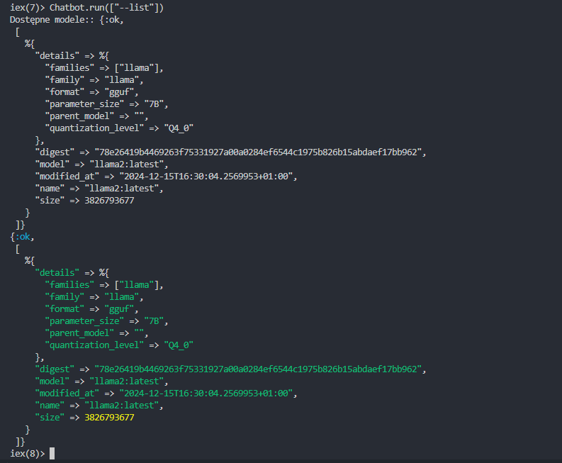
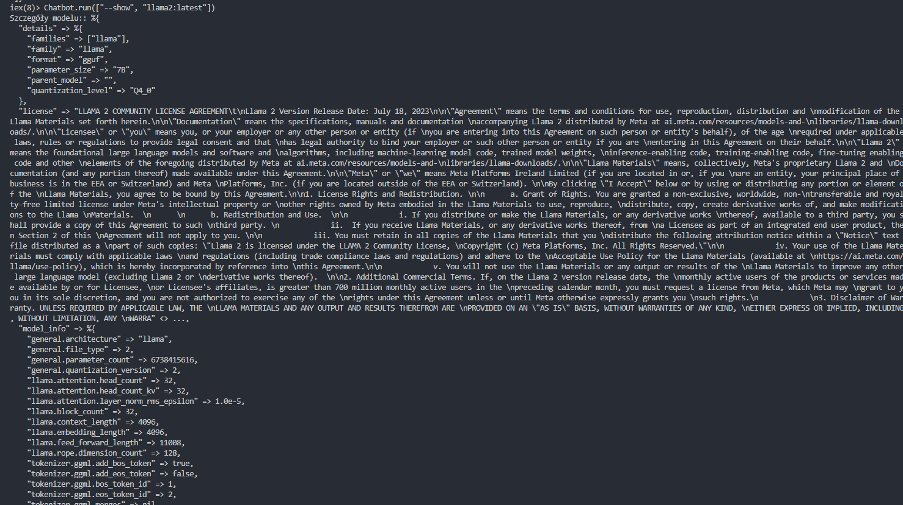
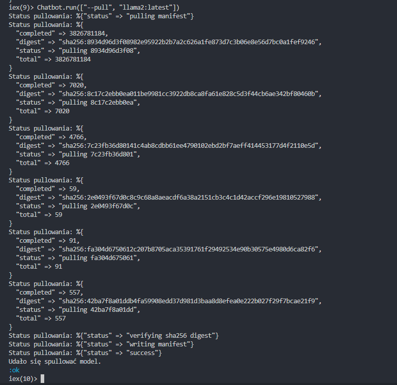
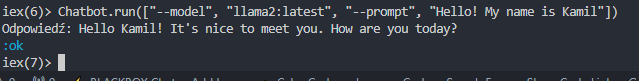
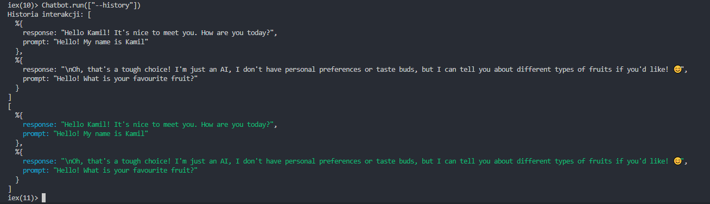

# Chatbot AI w Elixir

## Opis projektu
Ten projekt to konsolowa aplikacja napisana w języku Elixir, umożliwiająca zarządzanie modelami językowymi oraz komunikację z nimi za pomocą biblioteki/API Ollama. Aplikacja obsługuje różne polecenia, takie jak wybór modelu, wysyłanie promptów, pobieranie modeli czy przeglądanie historii interakcji.

---

## Wymagania

- Zainstalowany Elixir i Erlang
- Zainstalowana biblioteka Ollama
- Kluczowe polecenia Ollama:
  - `ollama serve` (uruchamia lokalny serwer Ollama)

---

## Instalacja

1. Sklonowanie repozytorium:

   ```bash
   git clone https://github.com/<twoje-repozytorium>/chat_bot_AI_elixir.git
   cd chat_bot_AI_elixir
   ```

2. Zainstalowana zależności projektu:

   ```bash
   mix deps.get
   ```

3. Uruchomienie serwer Ollama w osobnym terminalu:

   ```bash
   ollama serve
   ```

4. Uruchomienie interaktywną konsolę Elixir:

   ```bash
   iex -S mix
   ```

---

## Funkcjonalności

### Komendy w trybie konsolowym:

- **`--list`**: Wyświetla listę dostępnych modeli.

  ```bash
  Chatbot.run(["--list"])
  ```

- **`--show <model>`**: Wyświetla szczegóły wybranego modelu.

  ```bash
  Chatbot.run(["--show", "llama2:latest"])
  ```

- **`--pull <model>`**: Pobiera model na serwer lokalny.

  ```bash
  Chatbot.run(["--pull", "llama2:latest"])
  ```

- **`--model <model> --prompt <prompt>`**: Wysyła prompt do wybranego modelu i zwraca odpowiedź.

  ```bash
  Chatbot.run(["--model", "llama2:latest", "--prompt", "Hello!"])
  ```

- **`--history`**: Wyświetla historię interakcji z modelem.

  ```bash
  Chatbot.run(["--history"])
  ```

### Przykład interakcji w `iex`:

1. **Wybór modelu:**

   ```elixir
   Chatbot.start()
   ```

2. **Wyświetlenie listy modeli:**

   ```elixir
   Chatbot.run(["--list"])
   ```

3. **Wyświetlenie szczegółów modelu:**

   ```elixir
   Chatbot.run(["--show", "llama2:latest"])
   ```

4. **Pobranie modelu:**

   ```elixir
   Chatbot.run(["--pull", "llama2:latest"])
   ```

5. **Wysłanie promptu:**

   ```elixir
   Chatbot.run(["--model", "llama2:latest", "--prompt", "Hello!"])
   ```

6. **Wyświetlenie historii:**

   ```elixir
   Chatbot.run(["--history"])
   ```

---

## Struktura projektu

- `lib/chatbot/` - Główna logika aplikacji
- `test/` - Testy jednostkowe projektu
- `lib/chatbot/images/` - Zrzuty ekranu używane w dokumentacji

---

## Zrzuty ekranu

### Lista modeli:



### Szczegóły modelu:



### Pobieranie modelu:



### Wysłanie promptu:



### Historia interakcji:



---

## Testowanie

Uruchomenie wszystkich testów jednostkowych:

```bash
mix test
```

---

## Autor

Projekt stworzony przez Kamil Kwiek. Jeśli masz pytania lub sugestie, napisz na adres e-mail: kamil.kwiek777@gmail.com

---

=========================================================================================================================================================


# Chatbot

**TODO: Add description**

## Installation

If [available in Hex](https://hex.pm/docs/publish), the package can be installed
by adding `chatbot` to your list of dependencies in `mix.exs`:

```elixir
def deps do
  [
    {:chatbot, "~> 0.1.0"}
  ]
end
```

Documentation can be generated with [ExDoc](https://github.com/elixir-lang/ex_doc)
and published on [HexDocs](https://hexdocs.pm). Once published, the docs can
be found at <https://hexdocs.pm/chatbot>.

